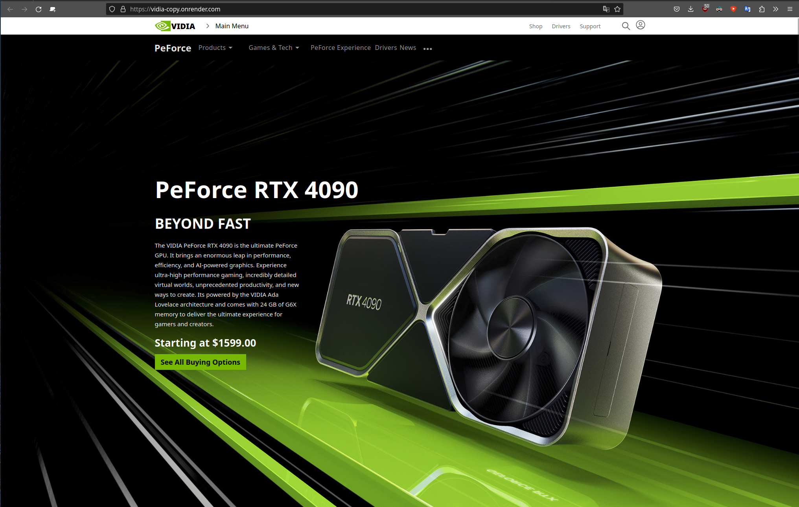

# VIDIA-RTX-40-product-detail #
# Table of Contents #
-[Header](#header) 
-[OuterNavBar](#outer-nav-bar) 
-[InnerNavbar](#inner-nav-bar) 
-[Accolades](#accolades) 
-[Architecture](#architecture) 
-[Performance](#performance) 
-[Raytracing](#raytracing) 
-[DLSS 3](#dlss-3) 
-[Reflex](#reflex) 
-[Creative](#creative) 
-[Additional Features](#additional-features) 
-[Specs](#specs) 
-[Gallery](#gallery) 
-[Shop](#shop) 
-[Development Setup](#development-setup) 
-[Tech Stack](#tech-stack) 
-[Why use Tailwind CSS?](#why-use-tailwind-css?) 
-[Contributors](#contributors) 

## Description ##

A full stack application including database, API server and website detailing a video card product similar to NVIDIA's RTX-40 series. 
See https://www.nvidia.com/en-us/geforce/graphics-cards/40-series/rtx-4090/ 

The motivation for this project stems from our teams interest into the tech world. The NVIDIA website has a high level of interactivity, featuring numerous animations and presenting a challenging environment for web development. By replicating this website, we open ourselves up to a learning opportunity that surpasses what we would gain from working on a less complex site.

# Website features #

## Landing Page ##
While simple in appearance, the landing page also serves as the React context used for the API queries to gather data required for the rest of the page. 

## Nav bars ##
The website features multiple responsive Nav bars.
## Header ##
 At the top, a header with the company logo and multiple links to other pages within the corporate website. The nav bar is hidden after scrolling past the landing page. Currently the links are dead, meaning they do not point to actual URLs. Additionally the login capability is still not implemented.

## Outer Nav Bar ##
Below the header, the outer nav bar features drop downs to navigate within the specific product category being advertised, in this instance the GPU product line and associated technology and information. This outer nav is shown at all times at the top of the page once the landing page is scrolled past.

## Inner Nav Bar ##
The inner nav bar is directly below the landing page, and as the user scrolls down it attaches itself below the outer nav bar and remains visible for the rest of the page. It features clickable links to go to various sections within the page, as well as an animated line indicating which section is currently being viewed which is dynamic with user input.

## Accolades ##
The accolades section utilizes a fading carousel feature that shows sentence length accolades about the product. 

## Architecture ##
This section utilizes an animated transform that is responsive to the user scrolling down the page. Upon reaching a breakpoint, the animation kicks off, moving the chip image to the right and then fading in to a set point on the section. In parallel the text changes to a grid of icons that feature the various benefits of the product's architecture. 

## Performance ##
This section features charts that detail the performance capability of the product with various technology features enabled as well as comparison to other products the company offers.

## Raytracing ##
The raytracing section features an image comparison tool, that allows the user to move a line element left and right that will show the difference between the product's ray tracing RTX feature on or off. 

## DLSS 3 ##
A youtube video is embedded showcasing the DLSS (Deep Learning Super Sampling) technoloy.

## Reflex ##
Similar to DLSS section, a youtube video is embedded to show the features of the product.

## Creative ##
The creative element is a dynamic feature that allows the user to choose what is visible below the navigator selectors. Similar to the inner nav bar at the top of the page, a green line indicates which section within the creative portion is currently in view. 

## Additional Features ##
Another section detailing the additional features and benefits of the product. 

## Specs ##

## Gallery ##

## Shop ##
The section to put all of NVIDIA's partners.

# Development Setup #

1. Install dependencies: `npm install`
2. Create your `.env` file: `touch .env`
3. Add your info in `.env`
4. Open Up Your Dev Environment `npm run dev`

# Tech Stack #
* [NodeJS](https://nodejs.org/en "Node")
* [React](https://react.dev/ "React")
* [Tailwind CSS](https://tailwindcss.com/)
    * [Tailwind Vite Install Guide](https://tailwindcss.com/docs/guides/vite)
    * [Tailwind Cheatsheet](https://tailwindcomponents.com/cheatsheet/)
* [Express]<http://expressjs.com/>
* [PostgreSQL]<https://www.postgresql.org/>

## Why use Tailwind CSS? ##
There are many benefits of using a CSS framework like Tailwind. Below are the major ones.
* _You write less custom CSS_. With Tailwind, you style elements by applying pre-existing classes directly in your HTML. By using utility classes in this way, you can build custom designs without writing CSS.
* _You keep CSS files small_. Without a framework like Tailwind, you have to keep writing CSS as you add new features and components. As a result, your CSS files continue to grow and get heavier. By using utilities like Tailwind’s flexbox and padding utilities, most styles are reusable so you rarely need to write new CSS.
* _You don’t have to invent class names_. When Tailwind, you’re choosing classes from a pre-defined design system. That means you don’t need to agonize over picking the “perfect” class names for certain styles and components, or remember complicated ones like sidebar-inner-wrapper.
* _You can make safer changes_. With the traditional approach, if you make changes to CSS, you may break something across your site. Unlike CSS, utility classes in your HTML are local. That means you can change them without worrying about breaking something else on your site.

## Contributors ##

[Bao Tran](https://www.linkedin.com/in/baottran21/):space_invader: 
[Nathan Vititoe](https://www.linkedin.com/in/nathanvititoe/) 
[Autumn Sheridan](https://www.linkedin.com/in/autumn-r-sheridan/) 
[Joey Laspe](https://www.linkedin.com/in/joe-laspe/) 
[Benjamin Schenk](https://www.linkedin.com/in/benjamin-k-schenk/)
